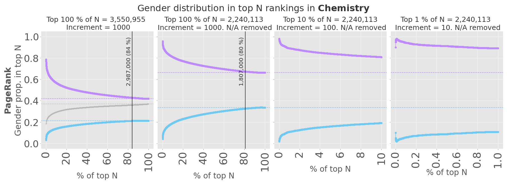
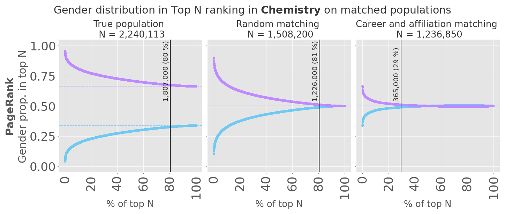

# A Fair Share: Fairness and Gender in Scholarly Rankings

Repository for BSc thesis **A Fair Share: Fairness and Gender in Scholarly Rankings**  
by Agnes Hardy Bertelsen (SWU) and Lasse Buschmann Alsbirk (DS), IT University of Copenhagen, 2021. 

This repository implements the end-to-end analysis pipeline described in section 3 (Data and Methodology) of the thesis.  
This pipeline was implemented and processed in a HPC cluster with a SLURM scheduler in a UNIX environment.
The code requires considerable memory and computing resources due to the size of the database and certain memory-intensive analysis tasks. 

### Requirements
* Snapshot of the [Microsoft Academic Graph](https://www.microsoft.com/en-us/research/project/microsoft-academic-graph/) (MAG) scientific publication database. Access can be requested from [Microsoft Academic](https://docs.microsoft.com/en-us/academic-services/graph/get-started-setup-provisioning). 
* Mapping between MAG author identifiers (AuthorId) and binary gender label (0 = women, 1 = men, -1 = non-genderized). This mapping was provided for our thesis by the authors of Huang et al. 2020 and stored in a text-file `WosToMag.txt` in the same destination as MAG files. 
* Python 3.8
* Spark (accessed with Pyspark)
* At least 400 gb of storage space

Install Python requirements using Anaconda: 
```
conda env create -f environment.yml
``` 

### Recommended directory structure    
```
|-- MAG
    |-- CentralityFairness
        |-- Analysis pipeline.ipynb
        |-- Evaluations
        |-- EVALUATIONS_OUTPUTS
        |-- EVALUATIONS_PLOTS
        |-- MATCHING_OUTPUTS
        |-- environment.yml
        |-- MAG_network.py
        |-- MAG.py
        |-- MAGspark.py
        |-- matching.py
        |-- README.md
        |-- visualizations.py
    |-- DATA
        |-- Affiliations.txt
        |-- Authors.txt
        |-- FieldsOfStudy.txt
        |-- PaperAuthorAffiliations.txt
        |-- PaperFieldsOfStudy.txt
        |-- PaperReferences.txt
        |-- Papers.txt
        |-- WosToMag.txt
        |-- NETWORKS
```
The files in the DATA repository - with the exception of `WosToMag.txt` - are downloaded from a MAG snapshot made available in an Azure Data Lake Storage environment. 

### Computational infrastructure
Several of the files in the MAG dataset are 40+ gb of size. As such it is not feasible to hold the data required in these experiments in memory on a single machine. Spark is incredibly well-suited for exactly this scenario, as it automatically schedules and distributes the required access to files onto any number of available machines. Spark also enables our analysis to be executed on a single machine, although this will be significantly slower than a distributed setup. 

We have set up a cluster of machines on the HPC at the IT University of Copenhagen, which uses a SLURM scheduler. Each machine has 8 cores, 32 gb of memory and 400 gb of temporary storage. Most of our analysis is executed on a Spark cluster with one master node and four worker nodes each accessing 4 cores and 20 gb of memory.  
We use a slightly modified version of the [`sparkhpc`](https://github.com/rokroskar/sparkhpc) library to launch Spark clusters. The modified version is available in a .zip file in `SPARKHPC/sparkhpc.zip` and should be placed in site-packages of the relevant conda environment.  

Our code is implemented such that the SLURM-based Spark cluster can be easily exchanged for Spark clusters running on other environments, for instance on cloud services. As such, the technical infrastructure can be easily scaled up and down according to available resources. 

The process of computing centrality measures is however not implemented using Spark due to a lack of graph-based functionality in Pyspark's GraphFrames. Instead we use the [`graph-tool`](https://graph-tool.skewed.de/) library by Tiago P. Peixoto. This functionality is executed on a single machine but is optimized to the fullest extent possible in terms of memory efficiency. Some networks grow very large in size, the most noticeable example being chemistry, which has 15 million nodes and 1.3 billion weighted edges: 


Roughly 110 gb of memory were required to process centrality measures on the chemsitry WACN. We were however able to process centrality measures on WACNs for economics, psychology and mathematics on machines with 32 gb of memory. 

### Core modules
This project implements a series of classes to interact with the MAG database and execute the analysis implemented in our thesis:  

**MicrosoftAcademicGraph**   
Located in `MAG.py`, this class is a modification of code provided by Microsoft to access the MAG in an Azure environment. 
Its main responsibility is loading datasets stored in text-files as Spark DataFrames to be accessed with Pyspark and Spark SQL.  
This class takes a Pyspark SparkSession instance in its constructor. 

**MAGspark.py**  
This file defines the Spark configuration used to access files with Pyspark. It allows for a single-node client as well as a cluster setup with multiple nodes. 

**CitationNetwork**   
Located in `MAG_network.py`, this module is responsible for the data pre-processing and creation of weighted author citation networks (WACN) for individual acadmic disciplines. 
WACNs are stored in Spark-accessible text files. This module also implements the calculation of centrality measures using `graph-tool`.  
See *Analysis pipeline* for further details.  

**Matcher**  
Located in `matching.py`, this class implements matching experiments on ranked lists of authors as described in the thesis' section 3. 
The Matcher class evaluates fairness on ranked list of authors selected from:  
1. The full list of genderized authors with more than 1 publication during their career
2. The list of authors selected by randomly matching every person from the smallest group with one person from the largest group. 
3. The list of authors matched on the first year of publication within a discipline, the last year of publication within a discipline as well as a bin of their best-ranked affiliation according to the affiliation MAG Rank.  
The class allows for experiments to be repeated (by default 50 times) and stored to file. It also stores ranking visualizations if requested.  

**Evaluator**   
Located in `Evaluations/Evaluator.py`, this class prepares and evaluates ranked lists of authors according to fairness measures `rND`, `rKL`, `rRD` and `equal_ex`. The fairness measures are implemented using code provided by Honoré and Warncke with some modification to optimize for runtime. 


### Analysis pipeline
This library implements the analysis pipeline depicted here:  


The full pipeline can be accessed and executed in a few lines of code. See the Jupyter notebook `Analysis pipeline.ipynb` for further details.  

**Example**:
The following function implements the full analysis pipeline for matching experiments:  
```python
def analysis_pipeline(mag, fos_id, fos_name, network_name, root_folder = "/home/laal/MAG/", 
                      mindate='1800-01-01', maxdate='2010-12-31', overwrite=False,
                      random_seed=11, repeat_matching=False):
    """
    Executes the end-to-end analysis pipeline for matching experiments for a single discipline.
    
    Params:
        @mag (MicrosoftAcademicGraph): MicrosoftAcademicGraph instance with active SparkContext
        @fos_is (int): field of study ID for discipline
        @fos_name (str): name of discipline
        @network_name (str): A name for the WACN. Will be stored in ../DATA/NETWORKS/
        @root_folder (str): folderpath for the root MAG folder
        @mindate (str): Minimum pub. date of citing or cited paper, format YYYY-MM-DD
        @maxdate (str): Maximum pub. date of citing or cited paper, format YYYY-MM-DD
        @overwrite (boolean): if true, overwrite existing networks with @network_name 
                              and re-compute centrality measures
        @random_seed (int)  : random seed used in matching experiments
        @repeat_matching (boolean): if True, repeat matching 50 times, else execute once
    """
    
    root_data_folder = root_folder + "DATA"
    
    # Initialize the CitationNetwork instance of current discipline
    network = CitationNetwork(mag, fos_id=fos_id, fos_name=fos_name, root_data_folder=root_data_folder)
    
    # Extract paper references and author-auhtor citations if not done already.
    # Discipline-specific references and citations will be stored in ../DATA/
    network.check_references_and_citations()
    
    # Compute and store WACN. Use overwrite = True to overwrite existing network file
    # Will be stored in ../DATA/NETWORKS
    network.save_author_network(network_name, mindate=mindate, maxdate=maxdate, overwrite=overwrite)
    
    # Load WACN into spark dataframe
    network_sparkdf = network.load_author_author_network(network_name)
    
    # Get the node and edge count of current WACN 
    network_sparkdf, nodelist = network.nodelist_and_edge_count()
    
    # Build DiGraph using graph-tool
    graph_output = network.build_graph(overwrite=overwrite)
    if graph_output is not None:
        graph, node_mapping, eweight = graph_output[0], graph_output[1], graph_output[2]
    
        # Compute centrality measures: 
        # in-degree and in-strength + out-degree and out-strength 
        # PageRank w. damping 0.85 and PageRank w. damping 0.5
        network.compute_centralities(graph, node_mapping, eweight, pr_damping=0.85, overwrite=overwrite)
    
    # Append binary gender attribute and MAG Rank to centrality CSV
    centrality_csv_path = network.append_gender_and_magrank()
    
    # Load genderized centrality scores into Pandas DF
    data = pd.read_csv(centrality_csv_path, sep="\t")
    
    print("")
    print("INITIATING MATCHING\n")
    
    # Initialize Matcher
    matcher = Matcher(centrality_df=data, 
                      random_seed=random_seed, 
                      field=network.fos_name, 
                      fos_id=network.fos_id, 
                      base_filepath=root_folder, 
                      mag=mag)
    
    # Load the list of authors with more than one publication in current discipline
    matcher.load_authors(folder_destination=root_data_folder + "/AuthorMetadataField.csv")
    
    # If repeat is requested, repeat matching experiments 50 times, else only once
    if repeat_matching:
        destination = root_folder + "CentralityFairness/{}_matching_results.csv".format(fos_name.lower())
        print("Running repeated matching and storing to {}".format(destination))
        # repeat matching and evaluation 50 times and visualize at seed 0
        results = matcher.repeatCycles(destination=destination, visualize_seeds=[0])
    else:
        results = matcher.cycle(random_seed, visualize=True, verbose=True)
    
    # Store results in Pandas DF and return
    results_df = pd.DataFrame.from_records(results)    
    print("Finished analysis pipeline")
        
    return results_df
```   


Now the pipeline can be executed with a single function call, in this case for the discipline of Sociology:   
```python
results_df = analysis_pipeline(mag, # mag is an instance of MicrosoftAcademicGraph
                              fos_id=144024400, 
                              fos_name="Sociology", 
                              network_name="Sociology2020", 
                              root_folder = "/home/laal/MAG/", 
                              mindate='1800-01-01', 
                              maxdate='2020-12-31', 
                              overwrite=False,
                              random_seed=11, 
                              repeat_matching=False)
```

### Visualizations
By default, the analysis pipeline with matching experiments processes and stores visualizations into the `EVALUATIONS_OUTPUTS` directory.  


The first visualization visualizes the full ranking of authors with more than one publication throughout their career as well as the gender proportions in the top 10 and top 1 %. It creates one plot for each centrality measure, seen here for PageRank in chemistry:  


The second visualization visualizes mathced rankings of authors with more than one publication throughout their career for the full ranking, randomly matched authors as well as authors matched in career and affiliation matching. It creates one plot for each centrality measure, seen here for PageRank in chemistry:  


The third visualization displays the CDF of an inter-event analysis on the number of days between consecutive publications for each gender on populations matched by career and affiliation matching. The plot reports the results of a two-sample Kolmogorov–Smirnov test on the two distributions. Seen here for chemistry:   
 

The fourth visualization displays the linear correlation between all pairs of rankings as well as corresponding Pearson correlations: 


